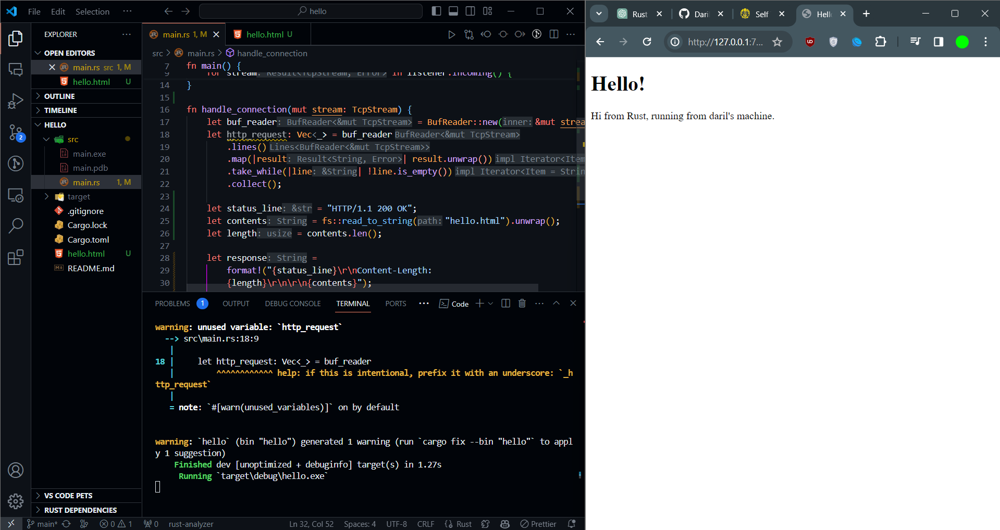
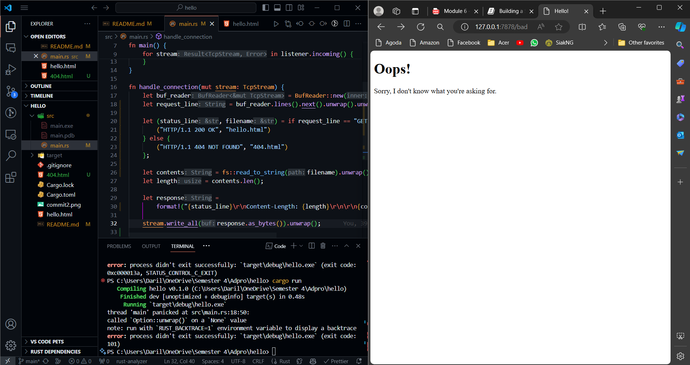

<h2>Commit 1 Reflection notes</h2>
<h4>What does the handle_connection() method does?</h4>

The handle\*connection() method takes TcpStream as a parameter which is mutable so that the method could read from and write to this stream.
Then, BufReader is added to add buffering to the read operations on the stream.
After that, it declares the http*request variable as a Vec<*> which is like an enum array that contains the buf_reader where it reads all the line from the incoming HTTP request until it reached an empty line.
Finally, it calls the println! macro to print the http request into the console.

<h2>Commit 2 Reflection notes</h2>

<h4>What does the updated handle_connection() method does?</h4>
On the updated method of handle_connection(), theres 4 new variables. The first one is status_line as a string that contains the value of the HTTP status.
Then, the contents variable holds the string of the hello.html file that has been unwrap by the unwrap() method, the contain of this html file will form the body of the HTTP response.
And for the length var is just used for determining the length of the contents variable.
Meanwhile, the response variable is to format all the necessary HTTP response from status, followed by the Content Length as a header and then the actual content read from hello.html.
Finally it calls the "stream.write_all(response.as_bytes()).unwrap()" to send the constructed HTTP response back to the client.

<h2>Commit 3 Reflection notes</h2>

With the updated code on the method, now the the server will serve the appropriate response on wether it's an appropriate request or not, each with their own respective html page.
For the refactoring part, it reduces the duplication on the if else statement where both basically do the same thing with the only difference is on the status code and the html file that it returns. Instead, we should move all the other stuff outside the if else statement, and we just need to check the status code and returning the appropriate filename respectively.

<h2>Commit 4 Reflection notes</h2>
On this updated code, the path /sleep is returning the hello.html file, but with an additional 10 seconds of sleep that makes the page to load for 10 second before actually rendering the successful HTML page. While one browser opens the /sleep path, when we try to open another browser that connects to the home "/" path, it will need to wait for the previous session to be finished, which is ineffective in a nowadays browser.

<h2>Commit 5 Reflection notes</h2>
Creating a ThreadPool here is basically to make our webserver could handle multiple request simultaneously by assigning each request to a different thread, with ThreadPool, we limits the maximum thread that are inside of the pool to prevent a DoS attack where a user sends millions of request to our server that could cause a havoc. With the current ThreadPool implementation, we limit the threads to have a maximum of 4 active thread so each request could be handled asynchrounously by each worker and it will improve the throughput of our webserver.
